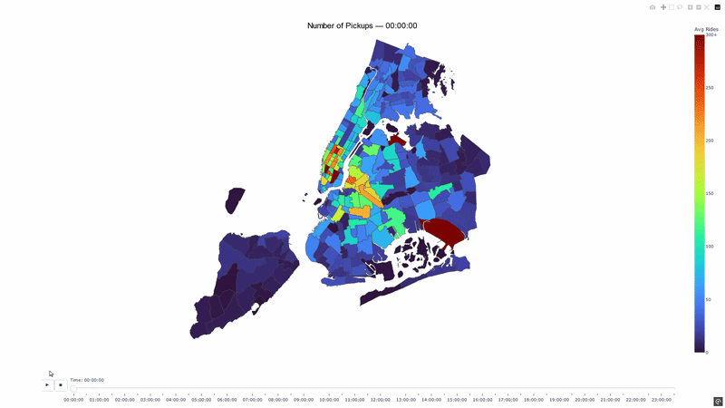

# NYC TLC Interactive Heatmap

## Problem & Project Objective

Ride-hailing demand varies throughout the day across different areas of New York City.

This project aims to help track ride demand across New York City by location and time of day using an interactive heatmap.

## Showcase 

The interactive HTML heatmap is generated in `03_outputs/nyc-tlc-interactive-heatmap.html`.

## Reproducibility & Setup

1. Make sure all packages in *"requirements.txt"* are installed
2. Go to *"01_docs\01_data\README.md"*, install raw data files and produce *"trip_data_with_zones.gpkg"* by running *"02_notebooks\01_data_preparation.ipynb"*
3. Run *"02_notebooks\02_heatmap_creation.ipynb"* to have *"03_outputs\nyc-tlc-interactive-heatmap.html"*

**Note:** Running *"02_notebooks\02_heatmap_creation.ipynb"* will directly open a tab of interactive map and also save HTML version to *"03_outputs"* folder. If you do not want either of them you can change the code inside *"02_heatmap_creation.ipynb"* according to the instructions.

## Project Structure

- **01_docs/** - Raw and processed datasets, official TLC guides and maps
- **02_notebooks/** - Jupyter notebooks used for data preparation and heatmap creation
- **03_outputs/** - Heatmap file in HTML format

## Workflow Overview

NYC TLC Trip Records (2024)
            │
            ▼
Load files
            │
            ▼
Filter & clean data
            │
            ▼
Join with Taxi Zone boundaries
            │
            ▼
Aggregate trips
            │
            ▼
Generate animated Plotly heatmap

## Data

**Source:** [NYC TLC trip records](https://www.nyc.gov/site/tlc/about/tlc-trip-record-data.page)
**Datasets:** All categories from **2024** year
**Size:** 298,930,712 total trips
**Features:** pickup_datetime, request_datetime, PULocationID
**Limitations:** Zones provide aggregated geographic regions rather than exact GPS coordinates limiting the resolution. Dataset records completed trips and does not include unmet demand, rejected requests. External factors which may influence demand such as weather, traffic conditions, and public events are not incorporated into the analysis.

## Tools & Technology

Programming language: **Python**
Core libraries: **duckdb, geopandas, imageio, pandas, plotly**
*Versions are included in* **requirements.txt**

## Limitations & Future Work

*"01_data_preparation.ipynb"* file created accordingly to 2024 year files specifically. Changes in file format in the following years would cause some errors or require different treatment. 
Additionally, *14,015,589* records belonging to the FHV dataset were deleted during the progress because they did not include pickup locations. These records represented approximately 4.7% of the total records, so they are unlikely to significantly affect the results.

## References

- New York City Taxi & Limousine Commission. *TLC Trip Record Data*.
  https://www.nyc.gov/site/tlc/about/tlc-trip-record-data.page

- NYC Taxi Zones
  https://www.nyc.gov/site/tlc/about/tlc-trip-record-data.page